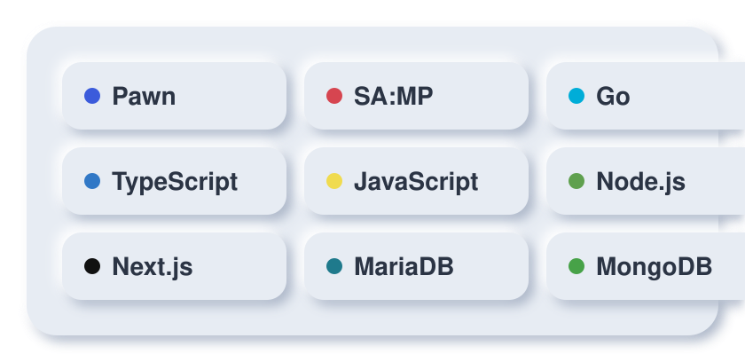

  <picture>
    <source media="(prefers-color-scheme: dark)" srcset="./assets/hero-dark.svg">
    
  </picture>

  
  
  
  

## About

I build clean, efficient, and modular backend systems, with a focus on
game-server logic and the tooling that keeps it maintainable.

- 🧠 Exploring backend technologies and new tooling
- 🎮 SA:MP game development and logic-driven systems
- 🔧 Clean architecture, automation, and low-level scripting

## Tech Stack

  <picture>
    <source media="(prefers-color-scheme: dark)" srcset="./assets/stack-dark.svg">
    
  </picture>

## GitHub Stats

  <picture>
    <source media="(prefers-color-scheme: dark)" srcset="https://streak-stats.demolab.com?user=ndyy2&theme=dark&hide_border=true&mode=daily&order=3&width=495&height=195">
    
  </picture>

  

